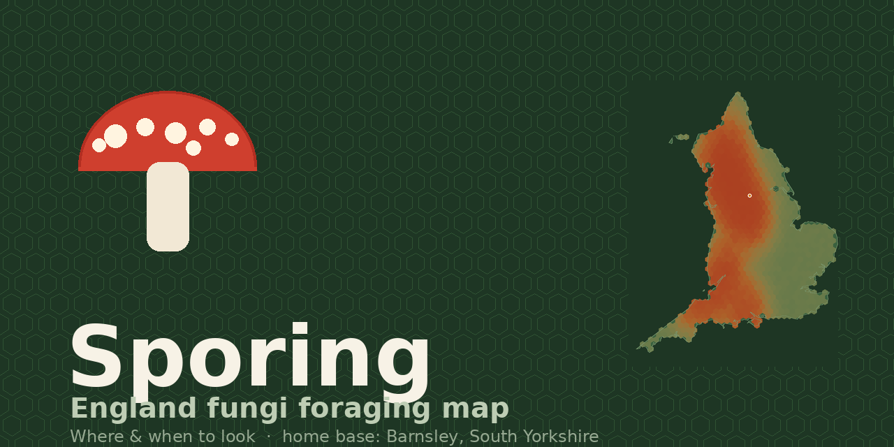
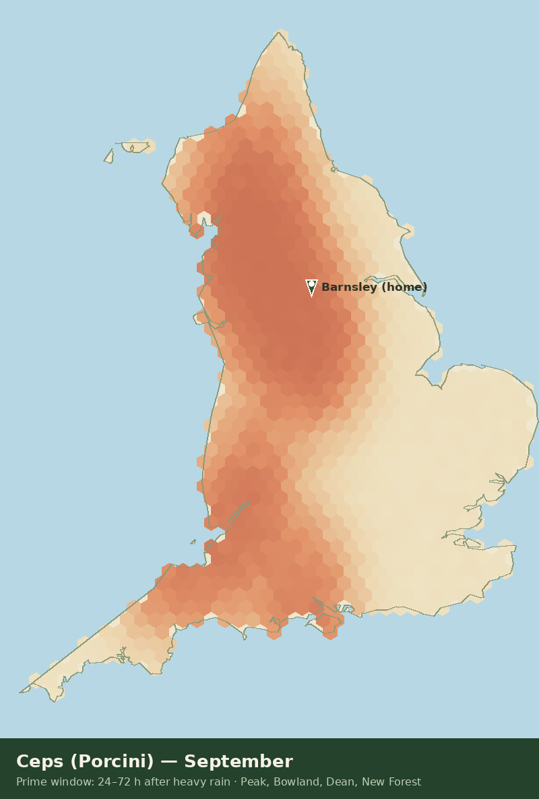
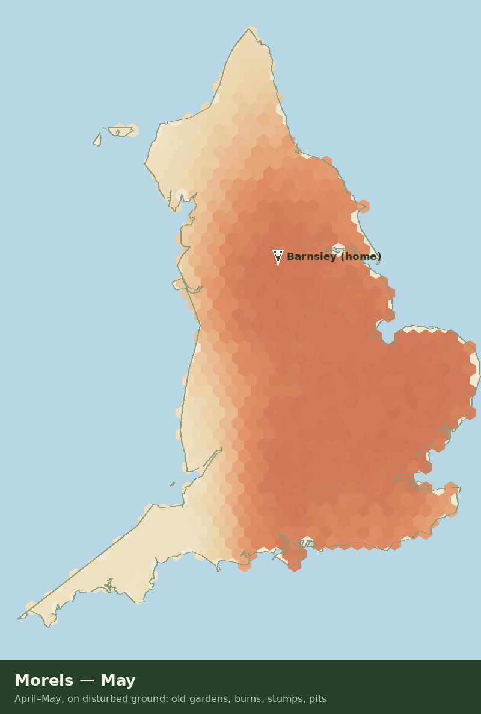
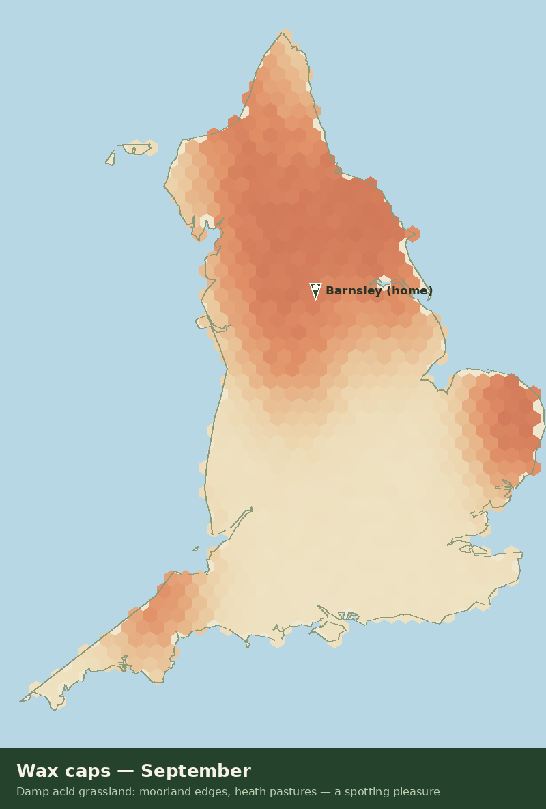

<p align="center">
  
</p>

<h3 align="center">Where & when to look for wild mushrooms in England 🍄</h3>
<p align="center">
  <b>A seasonal chance map for England's edible fungi — home base: Barnsley, South Yorkshire.</b><br>
  Installable PWA · works offline · no account · no tracking · your data stays on your phone
</p>

---

## What it does

Pick a mushroom, pick a month — the map paints England in hexes coloured by **chance of fruiting**:

| Month | What the map does |
|---|---|
| April–May | Morels light up on old gardens, burns, stumps and disturbed ground |
| Jun–Aug | Field mushrooms & ceps build up; oysters steady |
| **Sep–Oct** | **Prime season** — ceps, chanterelles, hedgehogs, honey fungus, wax caps |
| Nov–Dec | Oysters and honey fungus carry on through the frosts |

**Features**

- 🗺️ **Chance hex map of England only** — pan/zoom/pinch, offline (real OSM + Natural Earth coastline)
- 🛣️ **Street-level zoom** — the map can zoom to ~3 m/pixel with **OpenStreetMap street tiles** under the model layer (🗺️ toggle). Tiles are cached for offline use, so once an area has loaded you can walk its lanes without signal.
- 🎯 **Precise real finds** — **📡 "Pin real finds on the map"** pulls verified iNaturalist observations of the selected species around your base and pins their **actual reported coordinates** as diamonds (nearest first, tap for date, observer and a link to the record). Recent privacy-protected records are flagged as approximate.
- ⭕ **Precision rings on your pins** — every find you log carries a true ~60 m ground-radius ring, visible when you zoom to street level, so you know exactly where *you* found it.
- 📍 **Home pin at Barnsley** — plus "Near Barnsley (≤ 25 mi)" chance list in the panel
- 🧭 **Nearest spots to you** — use your GPS location **or a UK postcode** (Postcodes.io); see your closest logged finds and the best model ground for the selected species with bearing + distance, and one-tap "Go" to fly the map there (lands at street zoom)
- 🌧️ **Rain-window tracker** — checks the last 10 days of rain (Open-Meteo, no key) and tells you whether you're inside the fruiting window for the area, with a forecast nudge when the next heavy rain is coming
- 📖 **Field guide in-app** — per-species ID points, where/when to look, **toxic look-alike warnings**, and "when to go" rules that actually work
- 🔍 **iNaturalist deep-links** — jump from any species to verified public records near you (the real sightings database)
- 📓 **Private find logging** — drop a pin where you found something (date, note, ID confidence). Stored only on-device; every pin shows its current model chance. Delete anytime.

> **How to find a place to walk (the workflow):** set your location/postcode → check the rain card → "Pin real finds" for the in-season species → tap the nearest diamonds → walk the habitat the guide says to walk. Real pins tell you *a patch has produced before*; your own rings tell you *exactly where you found them*.

## Install on your phone

1. Open the site in your phone's browser.
2. **Android (Chrome):** menu ⋮ → **Add to Home screen**.
3. **iPhone (Safari):** Share → **Add to Home Screen**.
4. Launch from the home screen — it runs full-screen, offline, like a native app.

You can also tap **Install app** inside the ⓘ dialog.

## The maps

**Ceps (Porcini) — September** · peak window: 24–72 h after heavy rain


**Morels — May** · disturbed ground, spring


**Wax caps — September** · damp acid grassland, autumn


## How the chance is calculated

It's a **model estimate, not field reports** — honest about that, in-app. Each hex score is:

1. **Season** — a monthly fruiting curve per species (morels Apr–May, ceps Aug–Oct, oysters year-round peaking Sep–Nov…).
2. **Habitat** — weighted hotspots where the species is classically found: heath & old conifers for chanterelles, beech for hedgehogs, chalk downland for field mushrooms, dead hardwood for oysters…
3. **Climate** — a gentle latitude adjustment.
4. **Local texture** — deterministic per-hex noise so the map has organic variation.

The rain-window card then layers real recent weather on top, because rain is what actually triggers a flush.

## When & where to look (the rules that work)

- **24–72 h after 5 mm+ of rain** = the woodland window (ceps, chanterelles, hedgehogs).
- Grassland species come up **1–2 days after lighter rain**.
- Go in the **morning** — soft light, firm mushrooms.
- **Frosts trigger oysters** — hard-frost weeks are when they really show.
- Morels: **2–4 weeks after the last hard frost**, first warm spell of April–May.
- Mushrooms fruit in clusters — **find one, mark it, go back tomorrow**.
- Local consensus: South Yorkshire is **birch-bolete, oyster and morel** country; chanterelles are rarer here — the Dales and East Peak are where you go for a big flush.

### Around Barnsley — places worth walking

| Place | Look for | Access note |
|---|---|---|
| River Don & Dearne willow belts | Oysters on dead willow/poplar | Riverside access varies — check each reach |
| Rosthorn Common & woods (~1 mi S) | Morels in old ditches (spring), oysters on dead birch, waxcaps on damp ground | Common land — personal foraging traditional; check MBC bylaws |
| RSPB Old Moor (~2 mi E) | Scouting only — waxcaps, autumn bonnets | **RSPB rules: no picking** |
| Old greens, churchyards & hedgerows (Barnsley, Sprotbrough, Penistone, Wentworth) | Morels at old trees (spring), oysters at old stumps (autumn) | Ask first on managed churchyards |
| Blackburn Meadows / Cank Hill / Blacker Hill (NE) | Morels, oysters, honey fungus at old stumps | Check park rules; orchards may be private |
| **East Peak / Hope Valley (25–35 min)** | **Ceps, chanterelles, hedgehogs, birch boletes** — the best nearby ground | National Park commons; keep off SSSIs |
| Yorkshire Dales (~1 hr) | Chanterelles & waxcaps — the region's classic country | National Park rules apply |

## What to look for (quick ID + danger cards)

Full version is in the in-app 📖 guide. The non-negotiables:

- **Cep** — spongy pores, no gills, no staining. **Avoid red pores or blue-staining flesh** (Saddle/Fly/Red-billed boletes).
- **Chanterelle** — blunt ridges *running down the stem*, apricot smell, solid. False chanterelles stop at the stem / white spore print.
- **Morel** — honeycombed and **hollow to the base**. Cut lengthways: if solid, it's a false morel (Gyromitra — poisonous).
- **Field mushroom** — hardest ID group in foraging (lethal look-alikes in grass). Full 4-part check only: gill colour change, white spore print, pear smell, bruising.
- **Honey fungus** — take only mature specimens at stumps where you can see the **white cords**; young Death Caps can mimic young honey fungus.
- **Hedgehog & oyster** — among the safer first picks, but always two-source ID.
- **Wax caps** — spotting pleasure, not for eating.

> **The rule for everything else: when in doubt, throw it out.** Identification is your responsibility — use multiple guides.

## Responsible foraging (UK)

- Foraging for personal use is generally fine on public/common land — **ask permission on private land**, check bylaws, and **keep off SSSIs**.
- RSPB/nature-reserve land: **no picking** (scouting only).
- Take a little, leave the mycelium alive — what you don't pick is next year's.
- Wear bright clothing, tell someone where you're going, take a proper knife and a breathable bag.

## Data & credits

- Coastline & boundary: **OpenStreetMap contributors** (ODbL) + **Natural Earth** (public domain). England cut from the UK outline along the home borders.
- Street tiles: **OpenStreetMap** contributors, served from `tile.openstreetmap.org` (attribution shown in-app; usage per OSM tile policy — personal project, low volume, tiles cached on-device).
- Rain: **Open-Meteo** (free, no key). Postcodes: **Postcodes.io** (free).
- Verified find locations: **iNaturalist** observation API — data licensed **CC BY-NC 4.0** by iNaturalist and contributors; non-commercial use, attribution shown in-app.
- Chance model: this project (see "How the chance is calculated").

## Tech

Static PWA — no backend, no build step, no dependencies.

```
index.html  app.js  style.css     UI + all logic
data.js     791 hexes + England geometry (pre-projected Web-Mercator px)
sw.js       service worker — full offline shell + bounded OSM tile cache
manifest    PWA manifest + icons (incl. maskable)
docs/       README banner & map renders
```

- **Run locally:** `cd sporing && python3 -m http.server 8080` → http://localhost:8080
- **Tests:** jsdom smoke suite (rendering, species/month switching, log/popup/delete flow, postcode & rain fallbacks, out-of-England guard, street tiles, street-zoom clamp, precision rings, iNaturalist real-finds) — 62 assertions.

### Updating the England geometry

`data.js` is generated from OSM's England boundary relation (58447) + Natural Earth's UK polygon, clipped along the England–Scotland/Wales borders (Douglas–Peucker simplified, projected to an 800 px Web-Mercator canvas, hexed at 12 px). Regenerate with `uitest/make_assets.py` (renders) or the build script that produced `data.js` if you ever need a higher-resolution map.

## License

Code: **MIT**. Map data: **ODbL** (OpenStreetMap) / **public domain** (Natural Earth). Always attribute OSM contributors when redistributing map data.
